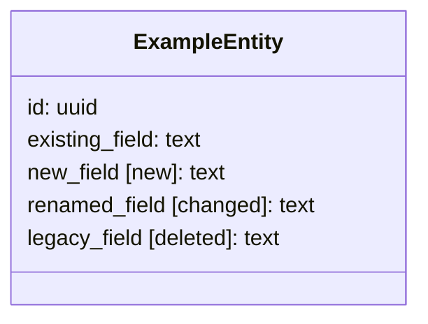

# Story Breakdown

This command is a single step of a longer pipeline:
```text
a-epic -> a-architecture -> a-story(s) -> a-criterion(s)
                                ^current
```
Next: `/a-criterion` consumes the numbered acceptance criteria and implementation plan produced by this command

### Pipeline I/O

| Direction | File | Description |
| --------- | ---- | ----------- |
| **In** | `./planning/<epic-slug>/epic.md` | User stories and epic-level UI references from `/a-epic` |
| **In** | `./planning/<epic-slug>/architecture.plan.md` | Epic-specific architecture from `/a-architecture` |
| **In** | `./planning/<epic-slug>/personas.md` | Personas from `/a-epic` |
| **In/Out** | `./planning/glossary.md` | Shared domain glossary from `/a-global-architecture` |
| **In/Out** | `./planning/global-architecture.plan.md` | Shared repo-wide architecture from `/a-global-architecture` |
| **Out** | `./planning/<epic-slug>/story-<story-number>.md` | Detailed story breakdown for this story, including story-level completion status, numbered acceptance criteria, story-relevant UI references, and the implementation plan that `/a-criterion` reads and updates |

## Skills

Invoke these skills when relevant:
- `ux-laws` for stories with UI
- `react-best-practices` when the project uses React
- `typescript-best-practices` when the project uses TypeScript
- `web-design-guidelines` when the story includes web UI

## Purpose

Break one story into a concrete, code-informed implementation plan without writing code. This command should:
- investigate the current codebase
- define reuse opportunities and constraints
- refine story-level details when needed
- capture schema-impact context when the story changes persisted data
- produce a single story artifact with numbered acceptance criteria and implementation-plan tasks for `/a-criterion`

## Rules

- NEVER write or modify application code, create commits, or write files outside `./planning/`
- NEVER skip codebase investigation; task planning must be grounded in the real codebase
- NEVER define synonyms; if a term exists in the glossary, use its canonical name
- NEVER abbreviate new names
- NEVER propose extractions for hypothetical future use
- NEVER write unnumbered acceptance criteria; `/a-criterion` depends on stable criterion numbers
- NEVER let implementation tasks float without a clear acceptance-criterion parent
- NEVER split implementation tasks by technology layer alone when one coherent story-slice task would be clearer
- refine higher-level artifacts only when the finding is durable and useful beyond this one local note
- If trailing guidance is provided, treat it as the highest-priority refinement input for this run. It may clarify scope, request plan changes, or include partial implementation direction, but it must not silently override the required story selector, glossary canon, validated references, or other hard command constraints

## Step 1: Resolve required inputs

`$ARGUMENTS` = `<story-number> [instructions-or-suggestions]`

Interpret argument shapes like this:
- this command accepts exactly one explicit argument: `<story-number>`
- any remaining text after `<story-number>` is optional high-priority guidance for this run
- epic selection is not accepted as a command argument

Examples:
- `/a-story 2` -> use the current epic and story `2`
- `/a-story 2 "Keep the existing webhook ingestion path and update the story plan around it"` -> use the current epic and story `2`, and treat the quoted text as highest-priority guidance

If `<story-number>` is empty or missing, stop and ask the user to provide it. Do not guess or continue with partial context.

If guidance text is present after `<story-number>`, treat it as the highest-priority refinement input for this run.

Guidance may include:
- clarifications
- changes to the story plan
- corrections to stale planning assumptions
- partial implementation notes that should shape the plan when validated

Use that guidance ahead of default planning heuristics and stale assumptions, but do not let it silently override the required story selector, `./planning/current.json`, followed references, or stronger source-of-truth evidence.

Resolve `<epic-slug>` from `./planning/current.json` field `epic-slug`.

If `./planning/current.json` does not provide `<epic-slug>`, stop and report the exact problem. Do not guess or continue with partial context.

Read:
- `./planning/<epic-slug>/epic.md`
- `./planning/<epic-slug>/architecture.plan.md`
- `./planning/<epic-slug>/personas.md`
- `./planning/glossary.md`
- `./planning/global-architecture.plan.md`

If `glossary.md` or `global-architecture.plan.md` is missing, stop and tell the user to run `/a-global-architecture` first.

If `epic.md`, `architecture.plan.md`, or `personas.md` is missing, stop and report the exact path checked.

If `./planning/current.json` is unreadable, malformed, or missing `epic-slug`, report that exact problem and stop.

Also follow references from every planning artifact read in this step. Treat each followed reference as required input for this run. If any followed reference cannot be found, accessed, or read, stop and report the exact reference and the file that referenced it.

When `epic.md` contains a `UI References` section, treat those references as required input for this run. Read and follow them before planning any story that has UI or depends on UI behavior.

Extract the requested story section from `epic.md`. The story context includes:
- title
- canonical story statement
- user context
- acceptance criteria
- dependencies

Also extract the epic-level sections from `epic.md` that apply across stories:
- draft ERD
- requirements
- UX considerations
- UI references
- references

Output:
```text
Story: <title>
Epic: <epic name>
Architecture: loaded
Personas: loaded
Epic-level context: loaded
Has UI: <yes | no>
UI references: <list or none>
```

## Step 2: Investigate the codebase

Use `global-architecture.plan.md` and `architecture.plan.md` to scope targeted code exploration to achieve the story acceptance criteria.

Use targeted search and explore agents to gather:
1. related existing code
2. patterns and conventions
3. reuse opportunities

Each investigation result should report:
- relevant files
- why they matter
- patterns to follow
- reusable components, services, types, or utilities
- naming matches or conflicts with the glossary

If the story affects persisted schema, also identify:
- affected entities or tables
- relationships relevant to the story
- fields that are new, changed, or deleted
- unchanged fields that are still relevant to the story's implementation or review

Display the findings before proceeding.

## Step 3: Check consistency

Based on the investigation, evaluate:
1. naming conventions
2. file placement conventions
3. API and service patterns
4. component patterns
5. test patterns
6. type and contract patterns

Flag inconsistencies that matter to this story. Do not fix unrelated issues.

## Step 4: Define UX

If the story has UI, use `ux-laws` and define:
- user flow
- states
- feedback
- accessibility requirements

Use the followed UI references to ground those decisions. Do not invent UI behavior that contradicts the referenced design artifacts unless the conflict is surfaced explicitly.

If there is no UI, explicitly note that UX/UI sections are skipped.

## Step 5: Define UI and extraction opportunities

If the story has UI, define:
- component inventory
- hierarchy
- important props and state boundaries
- styling approach
- responsive behavior

Then identify justified extractions:
- shared components
- shared utilities
- shared types
- necessary refactors

Only include extractions that are clearly warranted by this story.

## Step 6: Refine upstream artifacts when needed

This command may update higher-level artifacts when deeper investigation uncovers durable knowledge:
- update `epic.md` when the story wording, boundaries, sequencing, or dependencies need correction
- update `architecture.plan.md` when story work reveals epic-specific technical details other stories should inherit
- update `glossary.md` when durable domain names, code names, sources, or statuses are confirmed
- update `global-architecture.plan.md` only when the work reveals durable cross-epic structure

Summarize every such update in the output.

## Step 7: Write `story-<story-number>.md`

Write `./planning/<epic-slug>/story-<story-number>.md` with this structure:

This file is the single source of truth for the story. It captures story context, codebase findings, UX, UI, references, justified extractions, a story-level completion marker, numbered acceptance criteria, and the implementation plan that `/a-criterion` reads and updates.

```md
# Story <story-number>: <title>

> Epic: <epic name>
> Generated: <date>
> Source Story: `./planning/<epic-slug>/epic.md`

_As a_ [role], _I want_ [action], _so that_ [benefit].

## Status
- [ ] Story complete

## User Context
- ...

## Acceptance Criteria
1. [ ] ...
2. [ ] ...

## Codebase Context
### Related Code
- ...

### Patterns To Follow
- ...

### Reuse Opportunities
- ...

## Consistency Notes
- ...

## UX Definition
### User Flow
1. ...

### States
| State | Description | UI Behavior |
| ----- | ----------- | ----------- |

### Accessibility
- ...

## UI Definition
### Component Inventory
| Component | New/Existing | Location |
| --------- | ------------ | -------- |

### Component Hierarchy
- ...

## UI References
- Story-relevant subset of the epic-level UI references, plus any story-local UI references followed during this run
- If none exist, write `- None`

## Database Changes
- If the story changes persisted schema, include a Mermaid `classDiagram` that shows only the story-relevant entities/tables, their relationships, and the fields needed for implementation review
- In the diagram, explicitly mark changed fields inline using `[new]`, `[changed]`, or `[deleted]`
- Include unchanged fields only when they are relevant for understanding the story
- If the story does not change persisted schema, write `- None`



## Extractions
| What | From/Why | Target Location | Blocks Story? |
| ---- | -------- | --------------- | ------------- |

## Implementation Plan
### Acceptance Criterion 1
> Selector: `/a-criterion <story-number> 1`

#### Outcome
- Describe what must be true when this criterion is complete

#### Files Likely To Change
- `path/a`

#### Dependencies
- none

#### Implementation Tasks
- [ ] Task 1.1: <imperative title>
  **Type**: [component | hook | service | api | model | migration | test | config | refactor]
  **Files**: `path/a`, `path/b`
  **Description**: ...
  **Notes**: ...

### Acceptance Criterion 2
> Selector: `/a-criterion <story-number> 2`

#### Outcome
- ...

#### Files Likely To Change
- ...

#### Dependencies
- `1` | `Story <other-story-number>` | none

#### Implementation Tasks
- [ ] Task 2.1: ...

## Upstream Updates Applied
- ...

## References
- `./planning/<epic-slug>/architecture.plan.md`
- `./planning/global-architecture.plan.md`
```

Rules for the implementation plan:
- acceptance criteria must stay explicitly numbered, because `/a-criterion` selects by criterion number
- include a `## Status` section with `- [ ] Story complete`; `/a-criterion` owns updating it after implementation runs
- every `### Acceptance Criterion N` section must match an item in `## Acceptance Criteria`
- implementation tasks must be nested under their acceptance criterion and must never be mistaken for command selectors
- implementation tasks may be story-coherent rather than artificially isolated
- if a criterion needs a new type, validation, or helper to satisfy the slice, include it there instead of splitting it into a separate pseudo-task by default
- keep schema details in `## Database Changes`, not scattered across implementation-task prose, unless a task needs to call out a migration-specific nuance

## Step 8: Present to user

Summarize:
1. number of acceptance criteria
2. critical path
3. reuse opportunities
4. upstream updates applied
5. risks and open questions
6. recommended starting criterion

Ask the user to review before moving to `/a-criterion`.

## Success Criteria

- [ ] `story-<story-number>.md` exists
- [ ] all required inputs and followed references were validated before story planning continued
- [ ] `story-<story-number>.md` contains numbered acceptance criteria
- [ ] `story-<story-number>.md` contains a `## Status` section with `- [ ] Story complete`
- [ ] every acceptance criterion has a matching `### Acceptance Criterion N` section in `## Implementation Plan`
- [ ] implementation tasks are clearly nested under their acceptance criterion and cannot be confused with the `/a-criterion` selector
- [ ] implementation tasks are organized around coherent story-slice delivery, not just technology-layer isolation
- [ ] story-relevant UI references were carried into `story-<story-number>.md`, or `- None` was written explicitly
- [ ] when the story changes persisted schema, `story-<story-number>.md` contains a `## Database Changes` section with a Mermaid `classDiagram` covering the story-relevant entities and field-level `[new]`, `[changed]`, and `[deleted]` markers
- [ ] any durable naming updates were propagated to `glossary.md`
- [ ] any durable cross-epic structure updates were propagated to `global-architecture.plan.md`
- [ ] the user reviewed the output before the pipeline advanced

## Error Handling

- **Missing story number** — ask the user to provide a story number
- **Epic selection attempted in guidance** — explain that `/a-story` always uses `./planning/current.json` for epic selection; keep the resolved `<story-number>` and treat any remaining text as high-priority guidance only
- **Invalid `./planning/current.json`** — report the exact issue with the missing or malformed `epic-slug` field and stop
- **Story not found in `epic.md`** — list available story numbers and ask the user to pick one
- **Missing shared repo files** — tell the user to run `/a-global-architecture` first
- **Missing epic-specific files** — report the exact missing path and tell the user which earlier command to run
- **Missing or unreadable followed reference** — report the exact reference and originating file and stop instead of skipping it
- **No relevant code found** — say so explicitly and treat the story as a greenfield area while still following project-wide patterns
