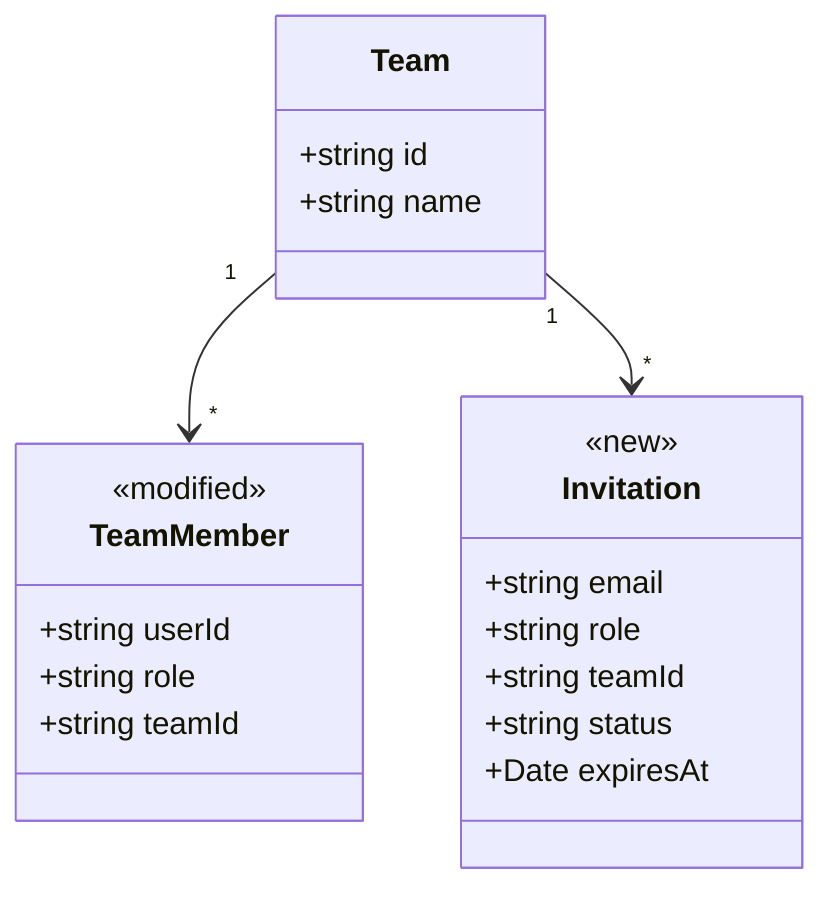
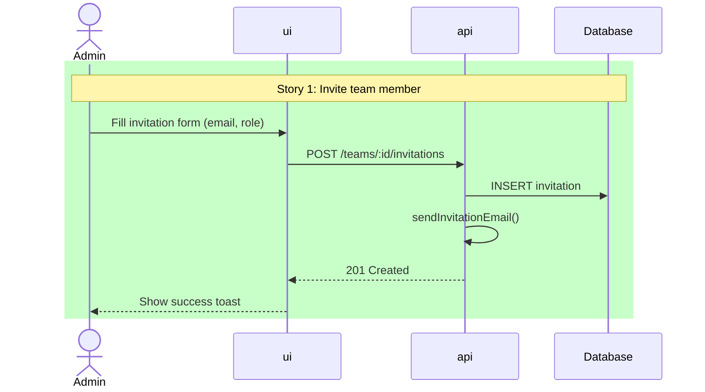

# Architecture

> **Scope**: TypeScript monorepo (Yarn/npm workspaces). Apps (`ui`, `api`, `admin`, etc.) + shared packages (`packages/*`).

Pipeline position:
```
p-epic -> p-personas -> p-architecture -> p-story(s) -> p-task(s-t)
                         ^current
```

### Pipeline I/O

| Direction  | File                                         | Description                                                                      |
| ---------- | -------------------------------------------- | -------------------------------------------------------------------------------- |
| **In**     | `./tmp/planning/<epic-slug>/idea.md`         | Raw epic idea                                                                    |
| **In**     | `./tmp/planning/<epic-slug>/epic.md`         | Stories from p-epic                                                              |
| **In**     | `./tmp/planning/<epic-slug>/personas.md`     | Personas (optional)                                                              |
| **In/Out** | `./tmp/planning/global-architecture.md`      | Global architecture map (read to skip re-exploration, updated with new findings) |
| **In/Out** | `./tmp/planning/glossary.md`                 | Shared glossary (created or updated)                                             |
| **Out**    | `./tmp/planning/<epic-slug>/architecture.md` | This document                                                                    |

## Skills

- `explore` — codebase exploration (Step 2)
- `ecoologic-code` — naming, patterns, domain alignment (Steps 2–4)
- `mermaid-diagrams` — diagrams (Step 5)
- `lovable` — when a Lovable prototype is detected in idea.md (Step 1a, Step 2)

## Rules

- NEVER write or modify application code, create commits, or write files outside `./tmp/planning/`
- NEVER define synonyms — if a term exists in the glossary, use its exact Code Name everywhere. One concept = one name
- NEVER abbreviate new names — use the domain's exact terms (`team-management`, not `team-mgmt`; `UserProfile`, not `UsrProf`)
- NEVER propose extra functionality for hypothetical future use (YAGNI)
- NEVER start implementation after generating planning artifacts

## Anti-Patterns

- NEVER commit to a technical decision without presenting options to the user first
- NEVER explore codebase without story list as context
- NEVER duplicate p-story's per-story deep investigation

## Step 0: Validate repo structure

Check for a root `package.json` with a `workspaces` field. If not found, warn:

> "This command is tailored for TypeScript monorepos (Yarn/npm workspaces). This repo doesn't match that structure. Proceed anyway? Examples and workspace-based exploration may not apply."

Use `AskUserQuestion` to confirm before continuing. If the user proceeds, adapt workspace references to whatever project structure exists.

## Step 1: Resolve input

`$ARGUMENTS` = `<epic-slug>`. Docs path: `./tmp/planning/<epic-slug>/`

Read `epic.md` (required — if missing, tell user to run `/p-epic` first) and `idea.md`. Extract epic name, slug, and all story summaries. Read `personas.md` if it exists.

### 1a. Detect Lovable prototype

Check if `idea.md` references a Lovable project (GitHub URL, mention of "lovable", or a `supabase/` directory). If found:

1. Clone or locate the Lovable repo
2. Flag it as a **prototype source** — this is the primary reuse/extraction target
3. In Step 2, dedicate one explore agent specifically to the Lovable codebase

Lovable prototypes are React + Supabase apps built for speed. They contain valuable prior art: UI components, page layouts, form patterns, Supabase queries, and edge functions — but typically lack the structure of the monorepo. The goal is to identify what to **extract and adapt**, not copy wholesale.

<example>
Epic: Team Management (team-management)
Docs: ./tmp/planning/team-management/
Stories: 4
  - Story 1: Invite team member
  - Story 2: Accept invitation
  - Story 3: Remove team member
  - Story 4: Manage roles
Personas: loaded
Lovable prototype: github.com/org/team-management-prototype (detected from idea.md)

Slugs use full words separated by hyphens. Never abbreviate.
</example>

## Step 2: Explore current codebase

### 2.0: Load existing architecture

Read `./tmp/planning/global-architecture.md` if it exists. Use it to skip redundant exploration — only explore areas not covered or potentially outdated.

### 2.1: Targeted exploration

Invoke `explore` skill. Read the root `package.json` to identify workspaces. Determine which workspaces are relevant to the stories.

Launch one explore agent per relevant workspace (max 3; group related ones if >3). **If a Lovable prototype was detected in Step 1a, reserve one agent slot for it** — it's the highest-priority reuse source.

Each agent prompt must:
1. Start with the story list from Step 1
2. Scope to its workspace directory (or Lovable repo)
3. Report: file paths, patterns, reuse candidates, extraction opportunities
4. Focus on: existing components/services/types that overlap with story needs

### Lovable prototype agent (when detected)

This agent explores the Lovable codebase with an **extraction mindset**:

<example>
Agent 1 — Lovable prototype (`../team-management-prototype/`):
"Given these stories from the Team Management epic: [...]

Explore the Lovable prototype. For each story, find:
1. Components that implement or partially implement the story (pages, forms, lists, modals)
2. Supabase queries and edge functions that match story data needs
3. UI patterns worth extracting: layout, navigation, form validation, toast/notification usage
4. Types and interfaces already defined
5. What works and can be adapted vs. what's prototype-only throwaway

For each finding, note:
- File path in prototype
- What to extract (component, pattern, query, type)
- Where it should land in the monorepo (which workspace)
- What needs to change (rename, refactor, split, generalize)"
</example>

### Monorepo workspace agents

<example>
Agent 2 — `ui/`:
"Given these stories from the Team Management epic: [...]
[If Lovable prototype exists: "A Lovable prototype exists with prior art. Focus on finding monorepo patterns and conventions that extracted code must conform to."]

Explore ui/src/. Find:
1. Existing components, pages, hooks that overlap with story needs
2. Patterns: how are list views, forms, and modals built?
3. Reuse candidates: shared components, hooks (useTeams, useMembers), utilities
4. File structure conventions: where do new pages, components, hooks go?"

Agent 3 — `api/`: same stories, scoped to api/src/. Focus on endpoints, services, models, middleware.
</example>

Invoke `ecoologic-code` to validate findings align with project conventions.

Output: summary of findings per workspace (and prototype, if present) before proceeding.

## Step 3: Domain glossary

Read `./tmp/planning/glossary.md` if it exists. Use its terms and Code Names consistently throughout all outputs. Never introduce alternative names for glossary terms. Merge new terms from Step 2 findings into it.

| Domain Term | Code Name | Definition | Source | Status |
| ----------- | --------- | ---------- | ------ | ------ |

- **Code Name**: actual class/type/table name in code (or `—` if new)
- **Status**: `exists` | `new` | `rename` | `exists (extend with ...)`

Invoke `ecoologic-code` to validate naming alignment.

<example>
| Domain Term | Code Name           | Definition                       | Source                | Status                        |
| ----------- | ------------------- | -------------------------------- | --------------------- | ----------------------------- |
| Team        | Team                | A group of users collaborating   | packages/shared-types | exists                        |
| Member      | TeamMember          | A user within a team with a role | packages/shared-types | exists                        |
| Invitation  | —                   | A pending request to join a team | —                     | new                           |
| Role        | role (string field) | Permission level: admin, member  | TeamMember.role       | exists (extend with 'viewer') |

"new" → model/migration tasks. "extend" → modification tasks. "exists" → no task needed.
</example>

## Step 4: Technical decisions

Organize around change types:

| Area | What Exists | What Changes | Decision | Rationale |
| ---- | ----------- | ------------ | -------- | --------- |

Action types: **Reuse as-is** | **Extend** | **Extract** | **New**

Cover only what's relevant to stories.

Invoke `ecoologic-code` to validate decisions align with existing patterns.

<example>
| Area             | What Exists                   | What Changes            | Decision                          | Rationale                                              |
| ---------------- | ----------------------------- | ----------------------- | --------------------------------- | ------------------------------------------------------ |
| Invitation form  | MemberForm in ui/src/members/ | Add email + role fields | Extend existing                   | Consistent with current form pattern, reuse validation |
| Invitation email | —                             | —                       | New: Lambda handler in api/       | Matches existing email handler pattern                 |
| Role selector    | RoleSelect in ui/src/shared/  | Add 'viewer' option     | Extend existing                   | Already used in 2 other views                          |
| Invitation list  | —                             | —                       | New: follow DataTable pattern     | Reuse pagination, sorting, filtering                   |
| Invitation type  | —                             | —                       | New: add to packages/shared-types | Keep types shared across ui and api                    |

Each row → one or more tasks. "Extend" = smaller task. "New following pattern" = task with clear reference.
</example>

If a decision has significant tradeoffs, present options with pros/cons and **ask the user** via `AskUserQuestion`.

## Step 5: Diagrams

Invoke `mermaid-diagrams` skill.

### 5a. Entity/class diagram (always)

Use `<<new>>` and `<<modified>>` stereotypes.

<example>

</example>

### 5b. Sequence diagrams (always, at least 1)

One per key flow. Use `rect` blocks to highlight new behavior, labeled with story name.

<example>

</example>

### 5c. Data model / ERD (only if DB changes)

### 5d. Change inventory (always)

Each row approximates one task.

<example>
| Type      | Name                            | Action | Story   | Details                                       |
| --------- | ------------------------------- | ------ | ------- | --------------------------------------------- |
| Type      | Invitation                      | new    | 1, 2    | Add to packages/shared-types                  |
| Model     | Invitation                      | new    | 1, 2    | email, role, teamId, status, expiresAt, token |
| Migration | add_invitations_table           | new    | 1       | invitations table with FK to teams            |
| Endpoint  | POST /teams/:id/invitations     | new    | 1       | Create invitation, send email                 |
| Endpoint  | POST /invitations/:token/accept | new    | 2       | Accept invitation, create TeamMember          |
| Component | InvitationForm                  | new    | 1       | Extends MemberForm pattern                    |
| Component | InvitationList                  | new    | 1, 3    | Follows DataTable pattern                     |
| Hook      | useInvitations                  | new    | 1, 2, 3 | CRUD operations for invitations               |
| Field     | TeamMember.role                 | modify | 4       | Add 'viewer' to allowed values                |
| Handler   | sendInvitationEmail             | new    | 1       | Follows existing email handler pattern        |
</example>

## Step 6: Story mapping

| Story | Workspaces | New | Modified | Reused | Risk |
| ----- | ---------- | --- | -------- | ------ | ---- |

Risk: `low` (isolated), `medium` (crosses workspace boundaries), `high` (shared-types or infrastructure change).

## Step 7: Write outputs

### 7a. Update shared glossary

Add new domain terms discovered during this step to `./tmp/planning/glossary.md`. Create the file if it doesn't exist. Never remove existing entries. Never rename existing terms — ask the user if there's a conflict.

### 7b. Write architecture.md

Write to `./tmp/planning/<epic-slug>/architecture.md`:

```markdown
# <Epic Name> — Architecture
> Epic: <epic-slug>
> Generated: <date>
> Stories: ./tmp/planning/<epic-slug>/epic.md
> Personas: <path or "N/A">

## Glossary
| Domain Term | Code Name | Definition | Source | Status |

## Codebase Landscape
### <workspace> (e.g. ui/)
### <workspace> (e.g. api/)
### <workspace> (e.g. packages/shared-types)

## Reuse and Extraction Plan
<!-- When a Lovable prototype exists, this section is critical — it maps prototype code to monorepo targets -->
| Candidate | Source | Action | Stories | Target Workspace |

## Technical Decisions
| Area | What Exists | What Changes | Decision | Rationale |

## Diagrams
### Entity Model
### Key Flows
### Data Model (if applicable)

## Change Inventory
| Type | Name | Action | Story | Details |

## Story Mapping
| Story | Workspaces | New | Modified | Reused | Risk |

## Risks and Open Questions

## References
```

`/p-story` reads this entire file for technical context.

### 7c. Update global architecture

Merge any new findings from Steps 2–6 back into `./tmp/planning/global-architecture.md`:
- New endpoints, packages, stores, hooks, services, or integrations discovered
- Updated domain entities or relationships
- Edit inline in the relevant section — do not append a changelog

This keeps the global file current for the next epic or coding session.

## Step 8: Present to user

Summarize: key decisions, new artifacts, reuse opportunities, risks. Ask to review before `/p-story`.

## Success Criteria

- [ ] architecture.md exists with all sections above
- [ ] Every story appears in Story Mapping AND Change Inventory
- [ ] Glossary has Status column for each term
- [ ] At least one sequence diagram uses `rect` to highlight new behavior
- [ ] Change Inventory lists every new/modified artifact
- [ ] Reuse Plan identifies opportunities (or explicitly states none found)
- [ ] No synonyms — every concept has exactly one name, consistent with the glossary

## Error handling

- **Missing epic.md** — "Run `/p-epic` first."
- **Empty/new codebase** — Skip Step 2, focus on greenfield decisions.
- **Unknown domain concepts** — Ask user via `AskUserQuestion`.
- **Missing personas** — Proceed without, note in output.

<example>
BAD: "The system should use a microservices architecture with event-driven communication"
BAD: "The Invitation aggregate root publishes InvitationCreated domain events via the bounded context's event bus"
GOOD: "Create Invitation type in packages/shared-types, model in api/src/models/ following Team.ts pattern. Fields: email, role, teamId, status, expiresAt, token. Add migration."
</example>
