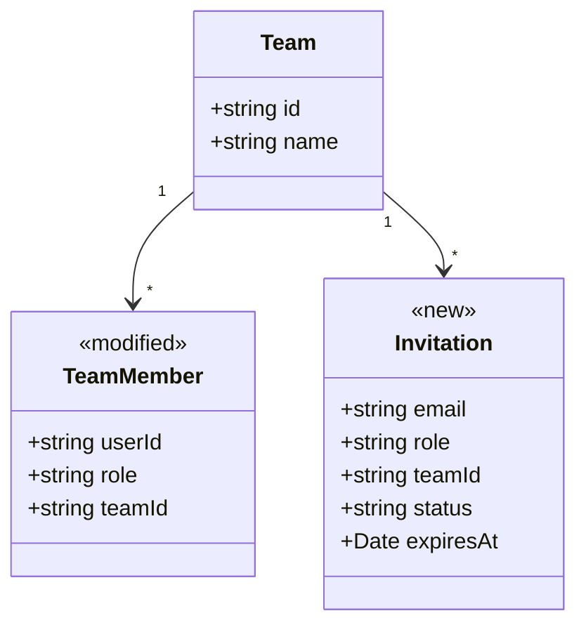
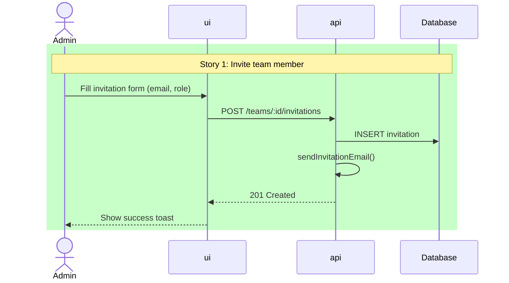

# Architecture

> **Scope**: Repository-agnostic. Use `./tmp/planning/global-architecture.md` to understand the current system shape before reasoning about any specific stack.

Pipeline position:
```
p-epic -> p-personas -> p-architecture -> p-story(s) -> p-task(s-t)
                         ^current
```

### Pipeline I/O

| Direction  | File                                         | Description                                                                                                   |
| ---------- | -------------------------------------------- | ------------------------------------------------------------------------------------------------------------- |
| **In**     | `./tmp/planning/<epic-slug>/idea.md`         | Raw epic idea and links to supporting artifacts                                                              |
| **In**     | `./tmp/planning/<epic-slug>/epic.md`         | Stories from `p-epic`                                                                                        |
| **In**     | `./tmp/planning/<epic-slug>/personas.md`     | Personas (optional)                                                                                          |
| **In/Out** | `./tmp/planning/global-architecture.md`      | Lean system map: major parts, responsibilities, communication paths, stable contracts, durable boundaries    |
| **In/Out** | `./tmp/planning/glossary.md`                 | Shared glossary (created or updated)                                                                         |
| **Out**    | `./tmp/planning/<epic-slug>/architecture.md` | Epic-specific architecture document, including inferred ERD, critique, recommended model, and change mapping |

## Recommended Process

Always work in this order:

1. Understand the feature from the epic inputs and referenced artifacts
2. Load `./tmp/planning/global-architecture.md` to understand the current system shape
3. Explore only the codebase areas that are relevant to the stories and still need confirmation

Why this order:
- feature understanding tells you what to look for
- `global-architecture.md` prevents broad, redundant repo exploration
- targeted code exploration should validate fit, reuse, constraints, and conventions, not define the epic from scratch

## Skills

- `explore` — codebase exploration (Step 4)
- `ecoologic-code` — naming, patterns, domain alignment (Steps 4–6)
- `mermaid-diagrams` — diagrams (Step 7)
- `lovable` — when a Lovable prototype or similar UI prototype is detected in the input files (Steps 1–4)

## Rules

- NEVER write or modify application code, create commits, or write files outside `./tmp/planning/`
- NEVER define synonyms — if a term exists in the glossary, use its exact Code Name everywhere. One concept = one name
- NEVER abbreviate new names — use the domain's exact terms (`team-management`, not `team-mgmt`; `UserProfile`, not `UsrProf`)
- NEVER propose extra functionality for hypothetical future use (YAGNI)
- NEVER start implementation after generating planning artifacts
- Treat the inferred ERD as a review artifact and hypothesis, not source-of-truth architecture
- Prefer existing code and established project conventions over prototype structure when they conflict
- If input files materially disagree, surface the conflict and ask the user before locking in architecture decisions
- Keep `global-architecture.md` lean and cross-epic; never let the current epic pollute it with story-specific rationale

## Anti-Patterns

- NEVER start with broad codebase exploration before understanding the epic inputs
- NEVER commit to a technical decision without presenting options to the user first
- NEVER explore codebase without story list as context
- NEVER duplicate p-story's per-story deep investigation
- NEVER silently trust a UI/prototype data model
- NEVER turn `global-architecture.md` into an epic diary

## Step 1: Resolve input files

`$ARGUMENTS` = `<epic-slug>`. Docs path: `./tmp/planning/<epic-slug>/`

Read:
- `epic.md` (required — if missing, tell user to run `/p-epic` first)
- `idea.md`
- `personas.md` if it exists
- `./tmp/planning/glossary.md` if it exists

Input files for this command means:
1. the pipeline inputs above
2. any design/product/technical artifacts they reference

Extract:
- epic name and slug
- story list and story summaries
- actors and personas
- obvious domain concepts and constraints
- all referenced artifacts that may clarify the target system

### 1a. Collect referenced artifacts

Follow references from the input files to supporting materials such as:
- UI designs
- prototype repos
- screenshots
- PRDs/specs
- schema docs
- API docs
- any other artifact that clarifies what this epic is trying to build

Keep an explicit list of which artifacts were read. These become part of the evidence base for `architecture.md`.

### 1b. Detect prototype sources

Check whether any input file or referenced artifact points to a prototype source (Lovable, Figma-linked prototype repo, low-code proof of concept, etc.). If found:

1. Clone or locate the prototype source
2. Flag it as a **prototype source**
3. In Step 4, dedicate one explore agent specifically to that prototype source

Prototype sources contain valuable prior art: UI components, page layouts, form patterns, queries, integrations, and data assumptions. They are useful for extraction and review, but they are not authoritative architecture.

<example>
Epic: Team Management (team-management)
Docs: ./tmp/planning/team-management/
Stories: 4
  - Story 1: Invite team member
  - Story 2: Accept invitation
  - Story 3: Remove team member
  - Story 4: Manage roles
Personas: loaded
Lovable prototype: github.com/org/team-management-prototype (detected from idea.md)

Slugs use full words separated by hyphens. Never abbreviate.
</example>

## Step 2: Understand the epic from input files

Before exploring the codebase, understand what this epic is trying to build.

From the input files and their referenced artifacts, derive:
1. the target user flows for this epic
2. the domain concepts implied by the stories
3. key relationships and constraints
4. the parts of the system likely to be involved
5. likely reuse opportunities or extraction candidates
6. open questions, weak assumptions, and contradictions in the inputs

This step is the bridge between product/design intent and system architecture. The rest of the command should answer: how does this epic fit into the current system, and what architecture should we recommend for it?

### 2a. Infer an ERD from the input files

Infer a provisional ERD or domain relationship model from all available input evidence, not only the UI.

Possible evidence sources:
- UI designs and prototype repos
- story text
- personas
- product specs
- schema notes
- API docs
- screenshots and flows

If there is enough evidence:
1. draft the ERD
2. include it in `architecture.md`
3. label it as an inferred review artifact, not accepted truth

If there is not enough evidence:
1. say so explicitly
2. record which inputs are insufficient
3. do not fabricate missing entities or relationships

### 2b. Apply source-of-truth hierarchy

When the inputs disagree, use this order:
1. input files and referenced artifacts beat guesswork
2. existing code and established project conventions beat prototype structure
3. the inferred ERD is a hypothesis that must be challenged before it shapes the final recommendation

If a contradiction materially affects the architecture, ask the user via `AskUserQuestion`.

## Step 3: Load existing architecture

Read `./tmp/planning/global-architecture.md` if it exists. Use it as the primary structural map of the current system.

Look for:
- major parts of the system
- responsibilities and ownership boundaries
- communication paths between parts (`ui -> api`, `api -> db`, jobs, queues, webhooks, external services, etc.)
- stable contracts and shared abstractions
- durable integrations and infrastructure assumptions

Use it to skip redundant exploration. Only investigate areas that are:
1. relevant to this epic
2. missing from the global map
3. potentially stale or contradicted by current code

If `global-architecture.md` is missing, incomplete, or clearly stale, do the minimum structural exploration needed to rebuild a lean, durable map. Do not re-document the whole repo.

## Step 4: Explore relevant codebase areas

Invoke `explore` skill. Determine which system areas are relevant based on:
1. the story list
2. the inferred target flows and entities from Step 2
3. the current structure described in `global-architecture.md`

Launch one explore agent per relevant system area (max 3; group related areas if >3). **If a prototype source was detected in Step 1b, reserve one agent slot for it** — it is the highest-priority reuse and critique source.

Each agent prompt must:
1. Start with the story list from Step 1
2. Include the inferred entities, flows, and open questions from Step 2
3. Scope to its directory, service, package, app, repo, or other relevant system area
4. Report: file paths, patterns, naming conventions, reuse candidates, extraction opportunities
5. Focus on: existing components/services/types/models/contracts that overlap with story needs
6. Note how this area communicates with the rest of the system

### Prototype source agent (when detected)

This agent explores the prototype source with an **extraction and critique mindset**:

<example>
Agent 1 — Lovable prototype (`../team-management-prototype/`):
"Given these stories from the Team Management epic: [...]

Explore the Lovable prototype. For each story, find:
1. Components that implement or partially implement the story (pages, forms, lists, modals)
2. Queries, edge functions, API calls, or data access that match story needs
3. UI patterns worth extracting: layout, navigation, form validation, toast/notification usage
4. Types, interfaces, or entities already implied
5. The ERD or domain model implied by the prototype
6. What works and can be adapted vs. what's prototype-only throwaway

For each finding, note:
- File path in prototype
- What to extract (component, pattern, query, type)
- Which current system area it should map to
- What needs to change (rename, refactor, split, merge, generalize)
- Which parts of the implied data model look suspicious or UI-shaped"
</example>

### Current system agents

<example>
Agent 2 — `apps/ui/`:
"Given these stories from the Team Management epic: [...]
[If a prototype source exists: "A prototype source exists with prior art. Focus on the project patterns and conventions that extracted code must conform to."]

Explore the UI area. Find:
1. Existing components, pages, hooks that overlap with story needs
2. Patterns: how are list views, forms, and modals built?
3. Reuse candidates: shared components, hooks (useTeams, useMembers), utilities
4. File structure conventions: where do new pages, components, hooks go?
5. How the UI communicates with the rest of the system"

Agent 3 — `services/api/`: same stories, scoped to the API area. Focus on endpoints, services, models, middleware, persistence, and communication with DB/external systems.
</example>

Invoke `ecoologic-code` to validate findings align with project conventions.

Output: summary of findings per system area (and prototype, if present) before proceeding.

## Step 5: Domain glossary

Use `./tmp/planning/glossary.md` as the naming source of truth. Never introduce alternative names for glossary terms. Merge new terms from Steps 2–4 findings into it.

| Domain Term | Code Name | Definition | Source | Status |
| ----------- | --------- | ---------- | ------ | ------ |

- **Code Name**: actual class/type/table name in code (or `—` if new)
- **Status**: `exists` | `new` | `rename` | `exists (extend with ...)`

Invoke `ecoologic-code` to validate naming alignment.

<example>
| Domain Term | Code Name           | Definition                       | Source                | Status                        |
| ----------- | ------------------- | -------------------------------- | --------------------- | ----------------------------- |
| Team        | Team                | A group of users collaborating   | packages/shared-types | exists                        |
| Member      | TeamMember          | A user within a team with a role | packages/shared-types | exists                        |
| Invitation  | —                   | A pending request to join a team | —                     | new                           |
| Role        | role (string field) | Permission level: admin, member  | TeamMember.role       | exists (extend with 'viewer') |

"new" → model/migration tasks. "extend" → modification tasks. "exists" → no task needed.
</example>

## Step 6: Technical decisions

Organize around change types:

| Area | What Exists | What Changes | Decision | Rationale |
| ---- | ----------- | ------------ | -------- | --------- |

Action types: **Reuse as-is** | **Extend** | **Extract** | **New**

Cover only what's relevant to stories.

Decisions must be grounded in:
1. the epic inputs and inferred target state
2. the current system structure
3. project conventions already present in the codebase

Invoke `ecoologic-code` to validate decisions align with existing patterns.

<example>
| Area             | What Exists                   | What Changes            | Decision                          | Rationale                                              |
| ---------------- | ----------------------------- | ----------------------- | --------------------------------- | ------------------------------------------------------ |
| Invitation form  | MemberForm in ui/src/members/ | Add email + role fields | Extend existing                   | Consistent with current form pattern, reuse validation |
| Invitation email | —                             | —                       | New: Lambda handler in api/       | Matches existing email handler pattern                 |
| Role selector    | RoleSelect in ui/src/shared/  | Add 'viewer' option     | Extend existing                   | Already used in 2 other views                          |
| Invitation list  | —                             | —                       | New: follow DataTable pattern     | Reuse pagination, sorting, filtering                   |
| Invitation type  | —                             | —                       | New: add to packages/shared-types | Keep types shared across ui and api                    |

Each row → one or more tasks. "Extend" = smaller task. "New following pattern" = task with clear reference.
</example>

If a decision has significant tradeoffs, present options with pros/cons and **ask the user** via `AskUserQuestion`.

## Step 7: Diagrams and model review

Invoke `mermaid-diagrams` skill.

### 7a. Inferred ERD from input files

Create a diagram that reflects the model implied by the input files and referenced artifacts.

Rules:
1. this is an inferred review artifact, not final truth
2. derive it from all useful input evidence, not only the UI
3. include it whenever there is enough evidence to infer a model
4. if the evidence is weak, explicitly say the ERD is partial or unavailable

Use `<<new>>` and `<<modified>>` stereotypes when helpful.

<example>

</example>

### 7b. Architectural critique of the inferred ERD

Critique the inferred ERD harshly using both architecture good practices and project conventions.

Evaluate:
1. entity and aggregate boundaries
2. ownership and lifecycle boundaries
3. relationship quality and direction
4. names, synonyms, and glossary alignment
5. consistency with existing code names and project conventions
6. suspicious UI-shaped entities or convenience-driven relationships
7. status blobs, nullable-field sprawl, duplicated data, and missing invariants
8. missing tenant/auth/access boundaries

The output should clearly say:
- what to keep
- what to rename
- what to split or merge
- what to remove
- what remains uncertain

### 7c. Recommended domain model

After critique and codebase comparison, propose the domain model that should guide this epic.

This section may differ from the inferred ERD. Prefer sound boundaries and existing conventions over prototype structure when they conflict.

### 7d. Sequence diagrams (always, at least 1)

One per key flow. Use `rect` blocks to highlight new behavior, labeled with story name.

<example>

</example>

### 7e. Change inventory (always)

Each row approximates one task.

<example>
| Type      | Name                            | Action | Story   | Details                                       |
| --------- | ------------------------------- | ------ | ------- | --------------------------------------------- |
| Type      | Invitation                      | new    | 1, 2    | Add to packages/shared-types                  |
| Model     | Invitation                      | new    | 1, 2    | email, role, teamId, status, expiresAt, token |
| Migration | add_invitations_table           | new    | 1       | invitations table with FK to teams            |
| Endpoint  | POST /teams/:id/invitations     | new    | 1       | Create invitation, send email                 |
| Endpoint  | POST /invitations/:token/accept | new    | 2       | Accept invitation, create TeamMember          |
| Component | InvitationForm                  | new    | 1       | Extends MemberForm pattern                    |
| Component | InvitationList                  | new    | 1, 3    | Follows DataTable pattern                     |
| Hook      | useInvitations                  | new    | 1, 2, 3 | CRUD operations for invitations               |
| Field     | TeamMember.role                 | modify | 4       | Add 'viewer' to allowed values                |
| Handler   | sendInvitationEmail             | new    | 1       | Follows existing email handler pattern        |
</example>

## Step 8: Story mapping

| Story | System Areas | New | Modified | Reused | Risk |
| ----- | ------------ | --- | -------- | ------ | ---- |

Risk: `low` (isolated), `medium` (crosses multiple system areas), `high` (shared contract, data boundary, or infrastructure change).

## Step 9: Write outputs

### 9a. Update shared glossary

Add new domain terms discovered during this step to `./tmp/planning/glossary.md`. Create the file if it doesn't exist. Never remove existing entries. Never rename existing terms — ask the user if there's a conflict.

### 9b. Write architecture.md

Write to `./tmp/planning/<epic-slug>/architecture.md`:

```markdown
# <Epic Name> — Architecture
> Epic: <epic-slug>
> Generated: <date>
> Stories: ./tmp/planning/<epic-slug>/epic.md
> Personas: <path or "N/A">

## Input Review
### Input Files
### Referenced Artifacts
### Input Conflicts and Gaps

## Glossary
| Domain Term | Code Name | Definition | Source | Status |

## Epic Summary
### Intended User Flows
### Key Domain Concepts
### System Areas Likely Involved

## Current System Landscape
### <system area>
### <system area>
### Communication Paths and Boundaries

## Reuse and Extraction Plan
<!-- When a prototype source exists, this section is critical -->
| Candidate | Source | Action | Stories | Target System Area |

## Technical Decisions
| Area | What Exists | What Changes | Decision | Rationale |

## Diagrams and Model Review
### Inferred ERD from Inputs
### Architectural Critique of the Inferred ERD
### Recommended Domain Model
### Key Flows

## Change Inventory
| Type | Name | Action | Story | Details |

## Story Mapping
| Story | System Areas | New | Modified | Reused | Risk |

## Risks and Open Questions

## References
```

`/p-story` reads this entire file for technical context.

### 9c. Update global architecture

Merge only durable structural findings from Steps 3–8 back into `./tmp/planning/global-architecture.md`:
- major system areas, modules, apps, services, packages, or repositories
- responsibilities and ownership boundaries
- stable communication paths between parts
- durable contracts, integrations, and infrastructure touchpoints
- stable entities or relationships only when they are truly cross-epic structure

Edit inline in the relevant section — do not append a changelog.

Do **not** merge back:
- current epic goals
- story-specific rationale
- temporary assumptions
- provisional domain decisions that exist only for this epic

This keeps the global file current for the next epic or coding session.

## Step 10: Present to user

Summarize:
- key decisions
- inferred ERD and the most important critiques
- recommended model changes
- reuse opportunities
- risks and open questions

Ask the user to review before `/p-story`.

## Success Criteria

- [ ] architecture.md exists with all sections above
- [ ] Every story appears in Story Mapping AND Change Inventory
- [ ] Glossary has Status column for each term
- [ ] architecture.md includes an inferred ERD, or explicitly explains why one could not be inferred
- [ ] architecture.md includes an architectural critique of the inferred ERD
- [ ] architecture.md includes a recommended domain model for this epic
- [ ] At least one sequence diagram uses `rect` to highlight new behavior
- [ ] Change Inventory lists every new/modified artifact
- [ ] Reuse Plan identifies opportunities (or explicitly states none found)
- [ ] No synonyms — every concept has exactly one name, consistent with the glossary
- [ ] global-architecture.md remains lean and contains only durable structural knowledge

## Error handling

- **Missing epic.md** — "Run `/p-epic` first."
- **Missing or weak global-architecture.md** — Perform minimal structural exploration and create/update a lean global map
- **Empty/new codebase** — Skip deep reuse analysis, focus on greenfield decisions for this epic
- **Inputs too weak for ERD** — State that the ERD is partial/unavailable and list the missing evidence
- **Conflicting input artifacts** — Surface the conflict and ask the user before finalizing architecture decisions
- **Unknown domain concepts** — Ask user via `AskUserQuestion`.
- **Missing personas** — Proceed without, note in output.

<example>
BAD: "The system should use a microservices architecture with event-driven communication"
BAD: "The Invitation aggregate root publishes InvitationCreated domain events via the bounded context's event bus"
GOOD: "Create Invitation type in the shared contract layer, model it in the API following the existing Team pattern, and store it in the current persistence layer. Fields: email, role, teamId, status, expiresAt, token. Add the required persistence change."
</example>
